# 2.自动识别初体验

> 本节课程所涉及到的问题均为Datawhale读者所遇到的实际问题，将八爪鱼的操作知识点融合在实际问题中，本节中的方案均为作者整理和思考后的原创方案，在学习输出成笔记的过程中请附带参考课程链接，感谢你对原创工作的支持！

完成了前面的课程学习，我们已经成功的安装了八爪鱼软件以及体验了简单的数据采集过程，在采集过程中我们使用了智能识别，在本节我们会根据实际的案例来学习八爪鱼操作中的其它自定义部分。

本节的知识点是如何使用八爪鱼的智能识别功能，并完成登陆、翻页等爬虫任务需求。其中带*为选学部分。

- [2.自动识别初体验](#2自动识别初体验)
  - [2.1微博数据抓取（登陆Cookie设置）](#21微博数据抓取登陆cookie设置)
  - [2.2豆瓣图书数据抓取（翻页与循环）](#22豆瓣图书数据抓取翻页与循环)
  - [2.3采集流程逻辑*](#23采集流程逻辑)
  - [2.4练习与思考](#24练习与思考)

## 2.1微博数据抓取（登陆Cookie设置）

你是Datawhale的一个读者，在Datawhale的公众号上看到了相关文章[《我用“觉醒年代”做数据分析》](https://mp.weixin.qq.com/s/f_euOxrMKEh5Db2ixVhTjw)，在文章中使用了爬虫爬取了微博关键词下的相关信息，你也想爬取微博的相关数据，那么如何用八爪鱼来操作呢？

我们打开八爪鱼范围微博的官网https://www.weibo.com/

通过观察发现，想要搜索微博的相关信息需要先登陆微博的账号，我们先进入到浏览模式进行账号的登陆。

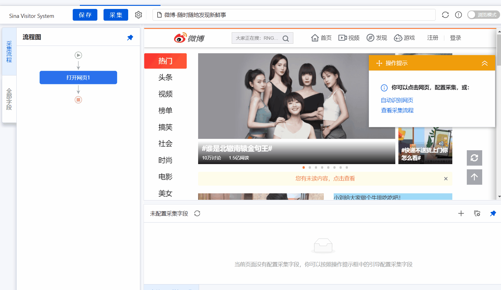

进入到浏览模式后，就是不会进行相关的采集工作，会像正常浏览器浏览数据一样，点击右上角的登陆进入到微博的账号登陆界面

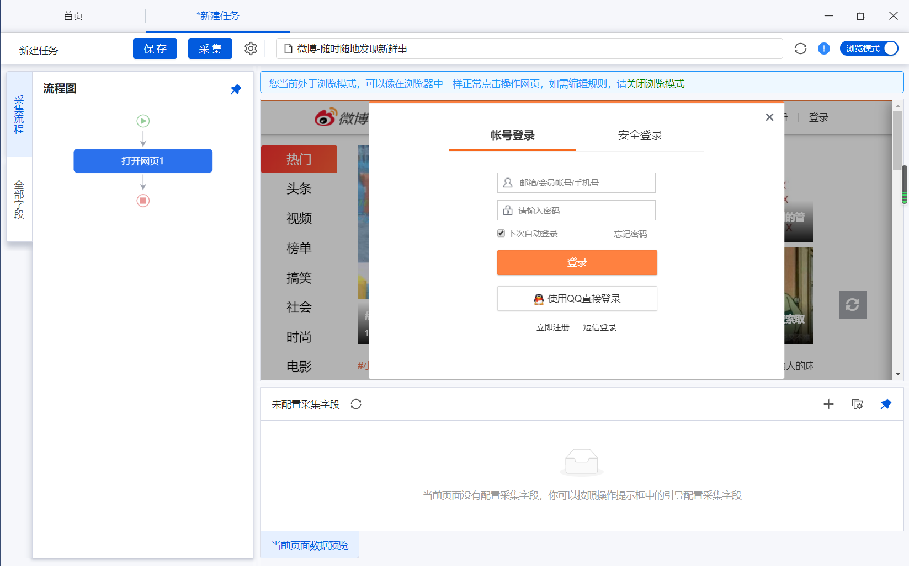

登陆完成后我们就进入到了全新的微博界面

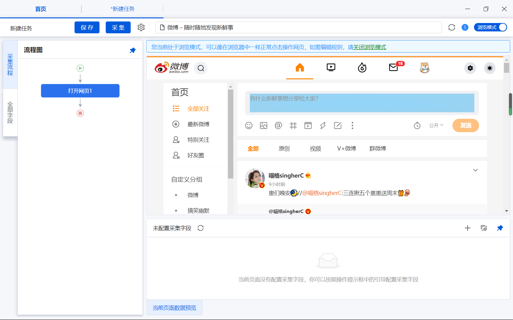

想一下如果每次数据抓取都需要登陆岂不是相当的麻烦，能不能让页面保持这个登陆状态呢？

我们需要了解一下Cookie

Cookie是某些网站为了辨别用户身份在用户本地终端上的数据（通常经过加密），由用户计算机暂时或永久保存的信息。

也就是如果我们能在打开网页时使用指定的Cookie，这样网页就能辨别我们的身份，从而避免了每次登陆网站需要登陆的问题，那么如何设置呢？

找到左边的流程图，设置打开网页的信息，设置设置使用指定的Cookie就可以了

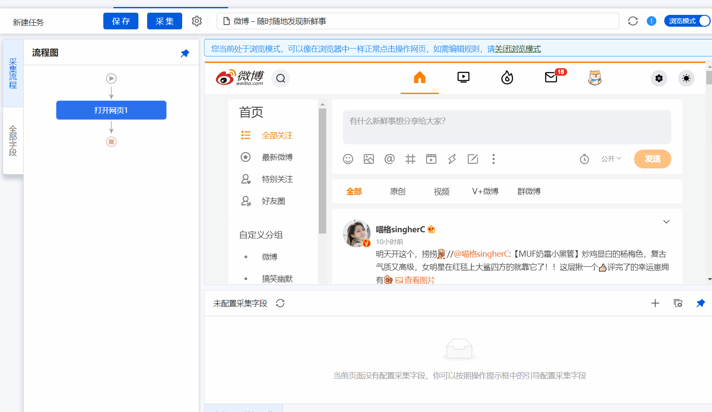

Cookie设置完成以后，退出浏览模型进入到数据爬取规则设置阶段

点击微博的搜索按钮，会出现智能提示，按照智能提示进行相关操作

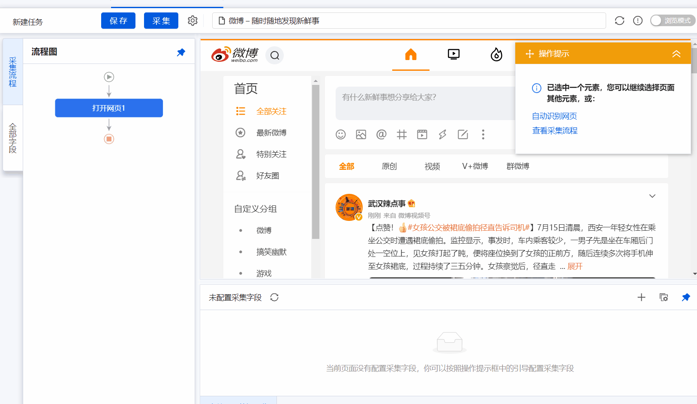

通过关键词的输入以及点击，我们进入到了觉醒年代话题下的相关微博，使用**自动识别**网页功能对网页进行识别

识别完成后，默认采集了14个字段

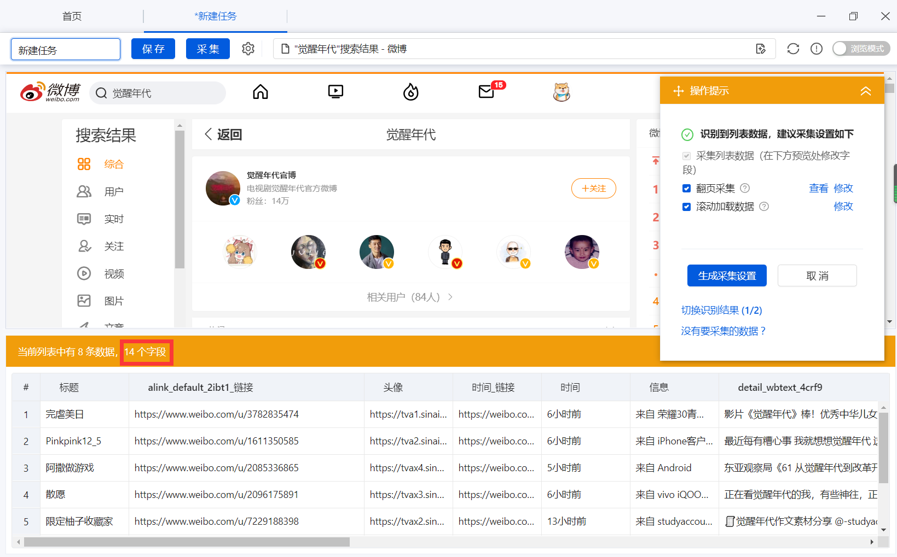

如果字段不全部是我们想要的，可以将不需要的字段删除掉

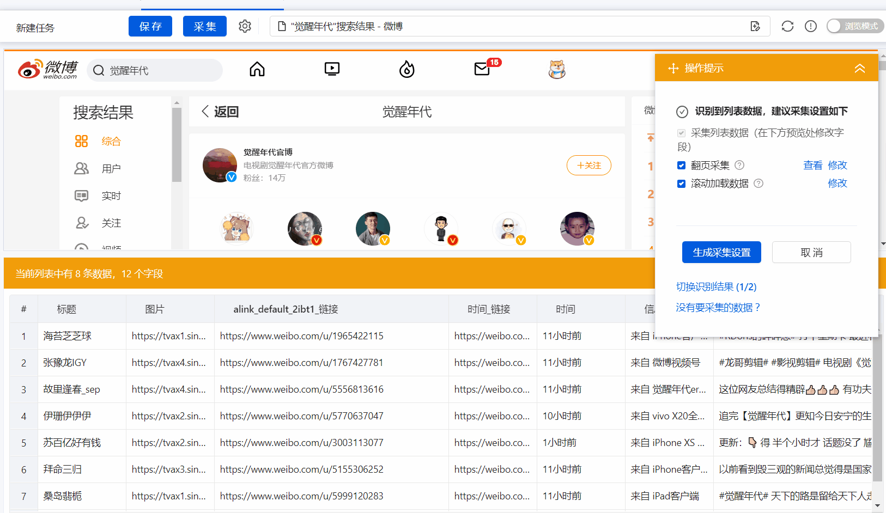

字段设置完成以后，点击生成采集设置，就可以对微博的数据进行爬取了

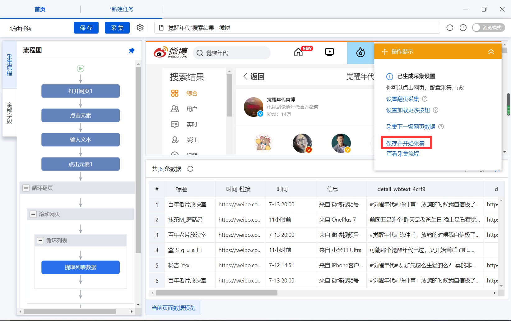

对于部分笔记本电脑，会出现采集卡顿的情况，可以在采集的过程中将采集的数据隐藏掉，可以提升采集的速度。

最后将任务修改名称后保存，可以在我的任务中找到设置的相应任务。

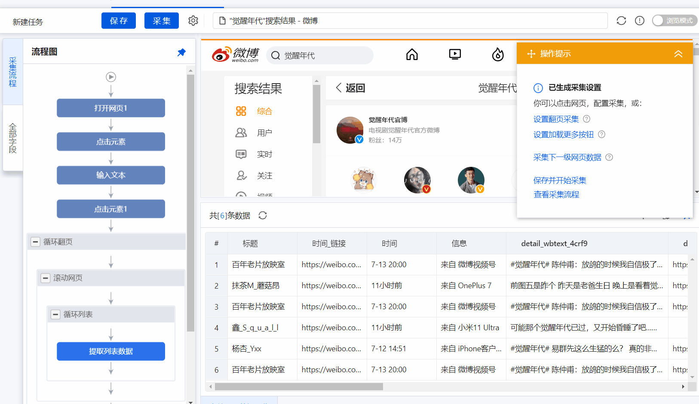

## 2.2豆瓣图书数据抓取（翻页与循环）

你是某高校的学生，你需要爬取豆瓣图书的相关信息进行做数据统计分析，需要知道每本书评价人数是多少，每个等级评价比例是多少

豆瓣图书的网址：https://book.douban.com/tag/%E5%B0%8F%E8%AF%B4

首先是登陆八爪鱼，进入到豆瓣的采集页面

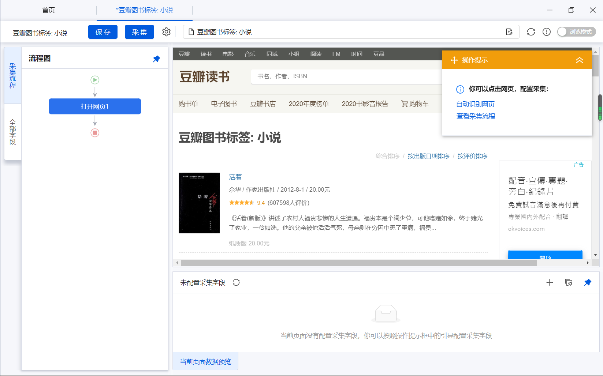

使用自动识别网页的功能对豆瓣的数据进行采集

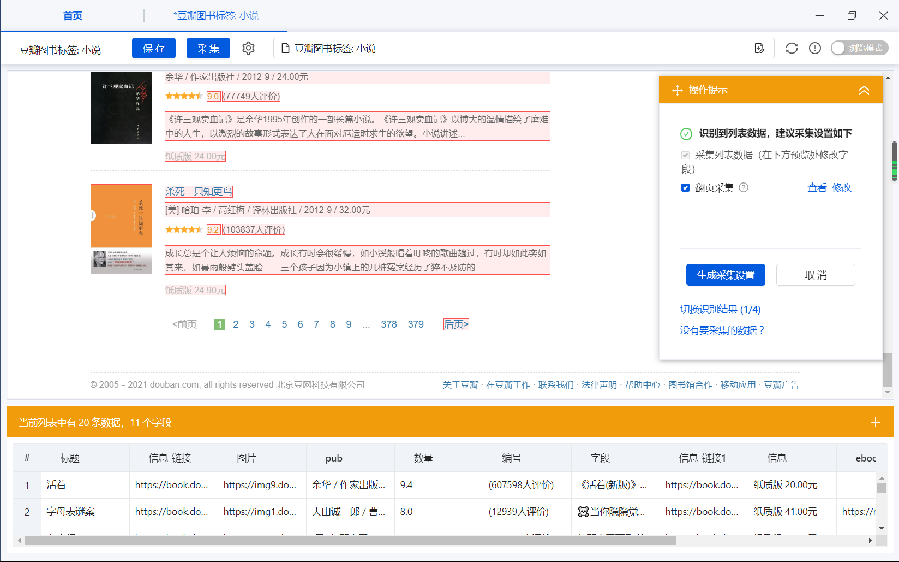

我们发现自动采集没办法满足我们数据采集的相关需求，我们需要对豆瓣的每个链接点击进入，然后去采集打分的人数以及比例，比如小说《活着》，有607608个人评价，同时我们需要采集不同星的比例，那么如果操作呢？

聪明的你看到这里你有2个思路

第一个是先采集各个书的链接，然后再依次打开各个书的链接进行数据采集

第二个是打开豆瓣的网站，然后点击第一个链接进入采集数据，然后返回到链接列表然后采集第二个链接

这里我们选择了第一个思路

**第一步就是采集各个图书的链接**

我们使用八爪鱼的自动识别功能对豆瓣网页进行识别

通过前面的测试我们看到自动识别采集了11个字段，而我们只要书的名称以及链接这个2个字段，其它的都删除。

可以不删除嘛？也是可以的，不过需要注意的是，采集的字段越多，采集的速度越慢，对于我们不需要的字段可以删除从而提升采集的速度，因此将不需要的字段删除

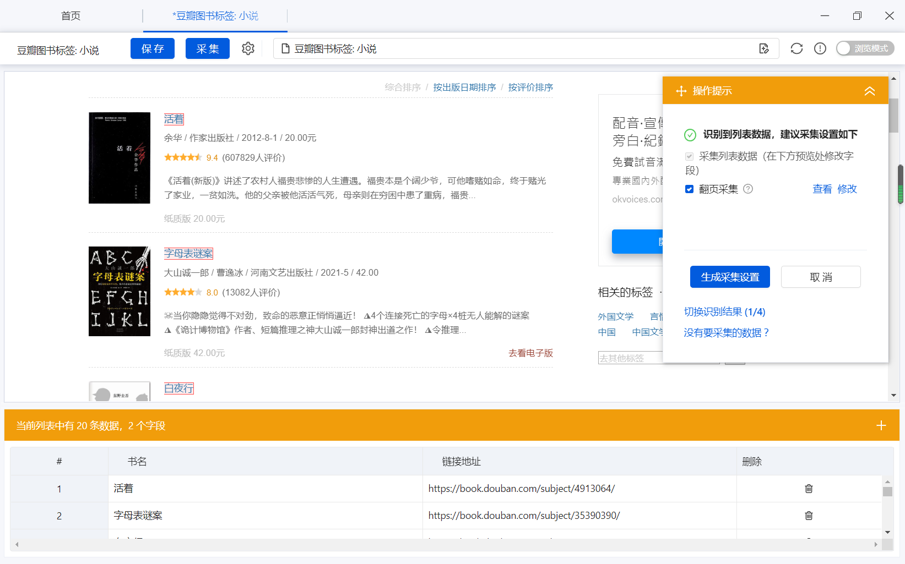

点击生成采集设置，点击保存并开始采集，点击启动本地采集。

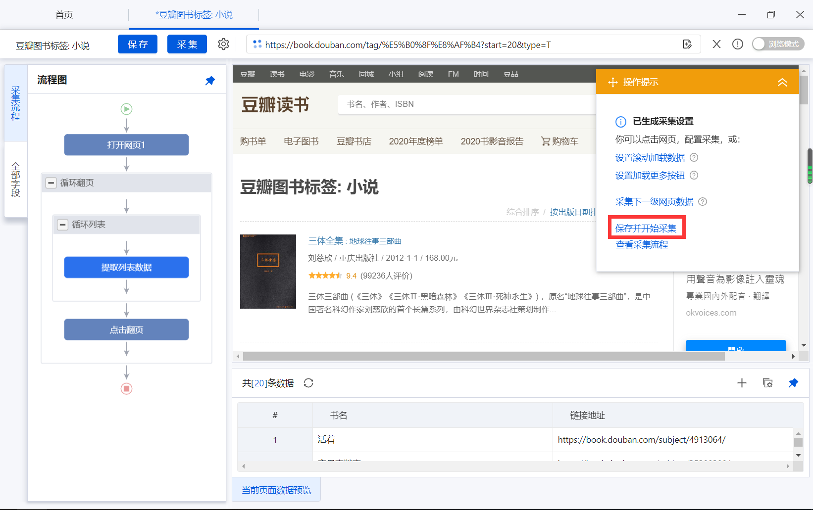

接下来就是漫长的采集等待...

实际的测试速度是25条/分钟，虽然这个速度对于无界面爬虫来说不算快，但是比手动快很多了

经过漫长的采集（一个午觉的时间）终于采集完成了...

我们看看采集的数据

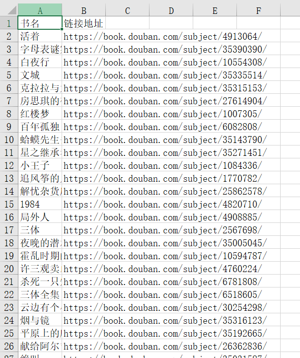

**第二步就是循环打开各个网页采集相关信息**

将前面采集的网页导入到八爪鱼中，如果数量超过了1万条可以分批导入

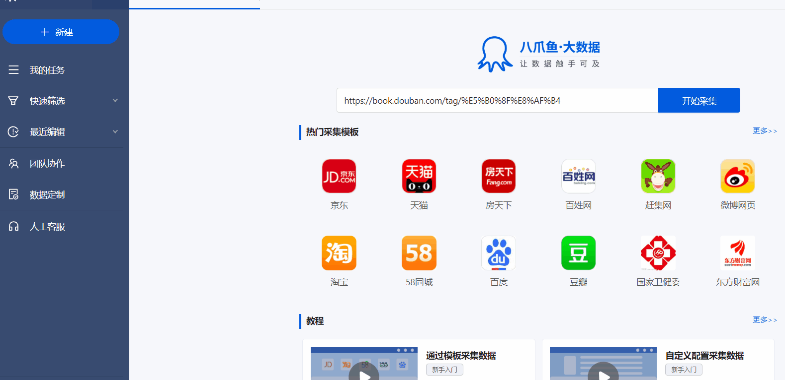

对网页的数据进行采集

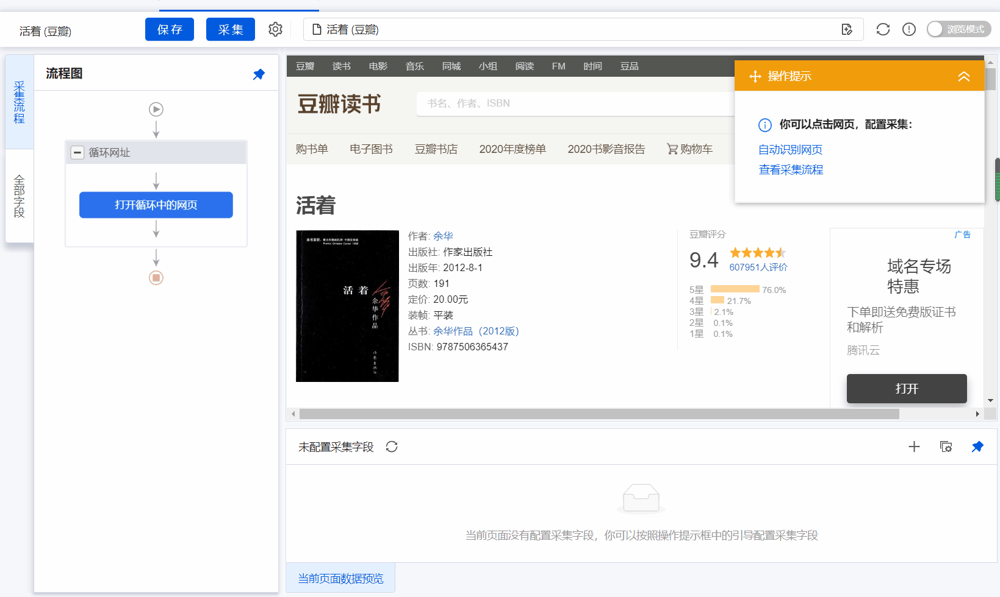

点击采集开始对最终数据进行抓取

## 2.3采集流程逻辑*

**八爪鱼的工作原理**

模拟人的行为，通过内置Chrome浏览器浏览网页数据，所以采集数据的第一步永远是找到目标网址并输入。这跟通过普通浏览器访问网页完全一样。在普通浏览器中需要点击链接进入详情、点击翻页按钮查看更多数据，在八爪鱼中也需如此操作。

**八爪鱼的流程逻辑**

八爪鱼通过【采集流程】全自动采集数据。【采集流程】执行逻辑遵循2个原则：**先从上至下、再由内而外**

【采集流程】由【蓝色步骤】和【灰色框】两大部分组成。【蓝色步骤】是会执行的步骤，八爪鱼与网页发生互动。【灰色框】起记录网页的作用。

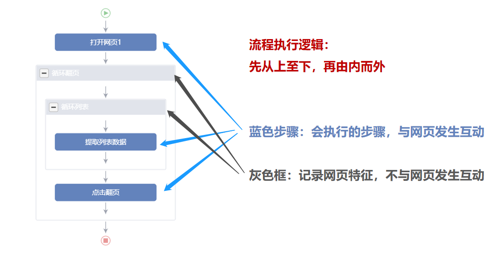

相关案例：

案例1

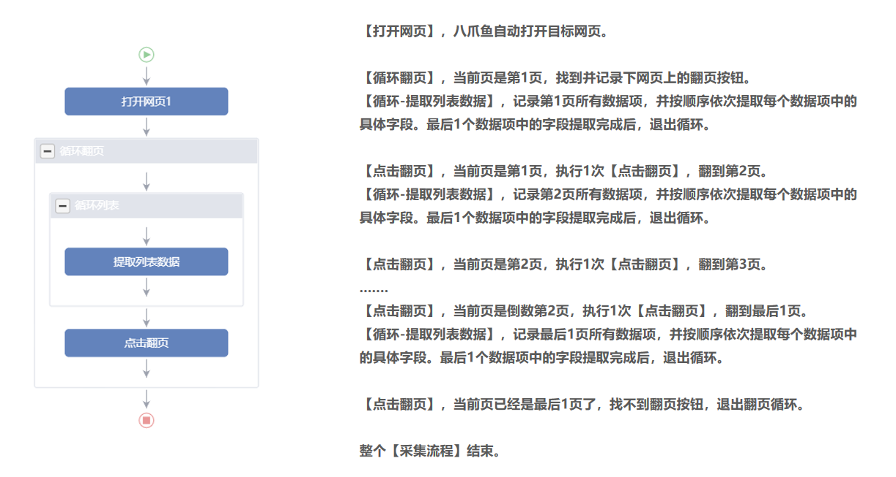

案例2

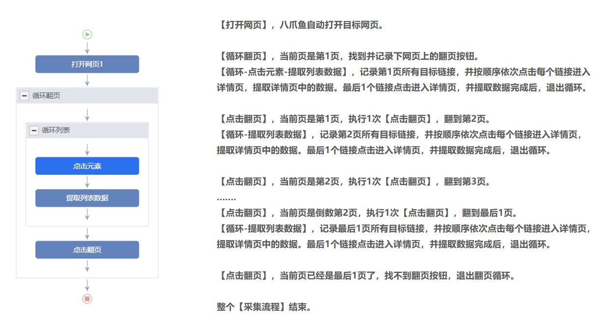

案例3

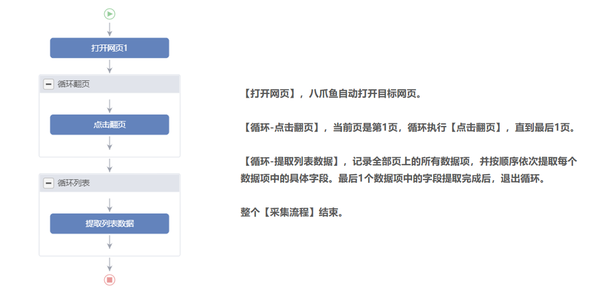

## 2.4练习与思考

前面的操作步骤你学会了吗？

如果还不是很清楚那就上手试一试吧，完成微博与豆瓣图书的数据采集，并将数据导出为excel形式

思考部分

1.抓取的微博数据算不算是个人隐私数据，如果是在使用中需要注意什么？

2.设置Cookie登陆的优势是什么？Cookie在平时手机和电脑使用中体现在哪些方面？

3.豆瓣图书数据采集中选择第一个思路的优势是什么？选择第二个思路的优势是什么？

参考链接：https://www.bazhuayu.com/tutorial8/81xsrm9

**Task2  END.**

--- By: 牧小熊

> 华中农业大学研究生，Datawhale成员, Datawhale优秀原创作者
>
> 知乎：https://www.zhihu.com/people/muxiaoxiong

关于Datawhale： Datawhale是一个专注于数据科学与AI领域的开源组织，汇集了众多领域院校和知名企业的优秀学习者，聚合了一群有开源精神和探索精神的团队成员。Datawhale 以“for the learner，和学习者一起成长”为愿景，鼓励真实地展现自我、开放包容、互信互助、敢于试错和勇于担当。同时 Datawhale 用开源的理念去探索开源内容、开源学习和开源方案，赋能人才培养，助力人才成长，建立起人与人，人与知识，人与企业和人与未来的联结，详情可关注Datawhale：

