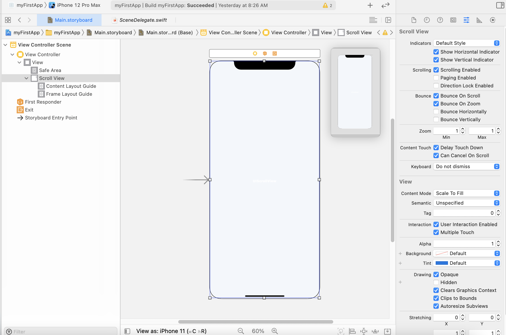

# ScrollView的应用

## 什么是ScrollView？

`ScrollView`(即滚动视图)可被应用到多种场景，例如：纵向滚动视图可以用来上下滑动以查看超出屏幕尺寸的内容，横向滚动视图可以用来实现翻页、轮播图等功能。事实上， 对某个图片的缩放、移动等功能也是由ScrollView 来实现的。在本章中，你将学会如何开启计时器，如何纵向、横向滚动查看页面，如何滑动查看图片以及实现轮播图等。

## Storyboard中添加Scroll View

在storyboard控件库中搜索`Scroll View`，并拖拽至面板中，放大到与屏幕同尺寸。



右侧属性栏中Indicators部分罗列了两种滚动条：`纵向滚动`与`横向滚动`，如果我们不想在滑动过程中显示这两种滚动条，取消勾选即可。


## ScrollView 的代理及基本属性

在 `Main.storyboard` 中添加了 ScrollView 之后，我们需要手动在 `UIViewController` 中代理`UIScrollViewDelegate`，实现步骤如下：

1. 打开`Main.Storyboard`，鼠标右键将`ScrollView`控件与`ViewController`面板相连，点击`delegate`

   

   

2. 打开 `ViewController.swift`，在 `class UIViewController` 后添加 `UISCrollViewDelegate`

代理仅仅允许滚动视图可以进行滚动，但并没有明确何时才进行滚动。因此我们需要监听 ScrollView(捕捉用户动作)，从而使当用户在上面做出滑动动作时，ScrollView 开始进行滚动。函数如下：

```swift
func scrollViewDidScroll(_ scrollView: UIScrollView){}
```

上述内容完毕后，我们即可在 `viewDidLoad()` 中对 ScrollView 进行各项参数初始化设置：

```swift
self.scrollView.contentSize = self.imageView.frame.size //(去掉自动布局)
//在图片内进行滚动，滚动范围为图片的尺寸

self.scrollView.contentSize = CGSize(width: lastImage.bounds.size.width, height:1000)
//在页面中滚动，滚动范围为代码所设置的页面尺寸

//在页面中滚动，手动设置移动坐标
var point:CGPoint = scrollView.contentOffset 
point.x += 150
point.y += 150 
self.scrollView.contentOffset = point

self.scrollView.setContentOffset(contentOffset:CGPoint, animated:Bool)
//加动画模式

self.scrollView.showsVerticalScrollIndicator = true self.scrollView.showsHorizontalScrollIndicator = false
//显示/隐藏水平、垂直滚动器

self.scrollView.contentInset = UIEdgeInsets(top:100, left: CGFloat,bottom: CGFloat, right:CGFloat)
//图片内边距
```


## 坐标参数

通常，我们以屏幕左上角作为坐标系的原点，垂直向下为y轴正半轴，水平向右为x轴正半轴。坐标需要专用的类型来定义，即 `CGPoint`：

```swift
CGPoint：坐标参数
CGSize：设置大小，如 ScrollView，TableView 大小等
CGFloat：CG 浮点数，用于计算坐标 
CGRect：设置尺寸，框架范围
```


## 实现竖直、水平滚动

1. 竖直滚动：竖直滚动既可以通过 storyboard 实现，也可以通过代码实现，在 `viewDidLoad()` 中添加代码部分如下：

   ```swift
   self.scrollView.contentSize = CGSize(width: lastImage.bounds.size.wid th, height:1000)
   ```

   其中，`width`、`height` 可以通过手动计算得出，也可以通过图片宽和高的对应乘积让编译器自己设置数值。值得注意的是，此处仅接受 `CGFloat` 格式。

2. 水平滚动：在纵向滚动处，我们可以通过 storyboard 来设置 `Image` 或者 `Button` 尺寸，但水平滚动则不同，我们无法通过一块屏幕来设置超出屏幕尺寸的多个横向图，因此需 要手动设置代码。在 `viewDidLoad()` 中：

   ```swift
   var imageView1 = UIImageView()
   imageView1.frame = CGRect(x: 0, y: 0, width: 414, height: 180) 
   imageView1.image = UIImage(named:"one.jepg") 
   scrollView.addSubview(imageView1)
   self.scrollView.contentSize = CGSize(width: 2050, height: 0) self.scrollView.showsHorizontalScrollIndicator = false滚动播放逻辑
   ```


## 滚动播放逻辑

我们经常会在一些 app 上看到置顶的一些循环播放的广告图，这些广告被称之为轮播图。事实上，轮播图的本质也是一种滚动视图，接下来的两个部分你将学着自己构建出一个轮播图。

想要实现图片的横向滚动播放，需要我们在预定区域内横向同时放置 5 张图片，通过 `ScrollView` 控件实现 5 张图片的滚动查看。本章中，我们已经学习了通过一个 `Button` 来实现图片滚动的方法，此部分我们将把图片滚动和计时器(NSTimer)绑定到一起从而达到自动播放的效果。由于计时器应在程序初始时加入到内存中，因此我们将代码写入 `viewDidLoad()` 内。初始化计时器代码如下：

```swift
let timer:Timer? = Timer.scheduledTimer(timeInterval: 3.0, target: sel f, selector:#selector(myTimer), userInfo: nil, repeats: true)
timer?.fire()
```

请注意，在 Timer 函数中我们擅自使用了#selector(myTimer)方法，此类方法需要

Objective-C 类型函数才能执行。事实上，随着学习内容的深入你会发现:在 Swift 中不仅仅是计时器才会用到`#selector` 方法，其他情况下如音频播放等基础功能也同样需要自定义 `selector` 的方法。事实上，所有的监听事件都需要`@obcj` 的方法来实现，不过随着版本的不断更新，Apple 逐渐在试着将这些 `objc` 的方法淡出 Swift 舞台，但这并不代表着你现在可以完全放弃使用 OC 的方法，本笔记中也会延续这一习惯。回到计时器问题上，此刻我们需要定义一个 OC 类型且并列于 `viewDidLoad()` 的函数：

```swift
@objc func myTimer(){}
```

至此，初始化计时器已经完成。我们先不急着将坐标偏移量与计时器函数绑定到一起，先试着让 `ScrollView` 页面可实现手动在几个图片之间滚动，以及将 `pageControl` 的 `currentPage` 与当前 `ScrollView` 页面同步。

如何才能实现两者同步滚动？由于 `scrollView` 与 `pageControl` 是两个独立的控件，我们没办法将两者进行绑定，二者的同步似乎成了一个难题。然而，换个思路看这个问题， 从结果导向和用户体验角度来说，我们仅仅希望看到当 `scrollView` 滚动时，`pageControl` 也随之滚动，至于两者是否是真的同步我们并不关心，也不用去确认他们两个是否真的被 绑定到了一起，只要让它看起来是一体化就达到了我们的目的。对于这个问题，一种比较常用的解决思路是计算当前图片在 `scrollView` 中偏移的 x 值，并用 x 值和当前页面图片 (以左上角为原点，横向为 x 正半轴，纵向为 y 轴正半轴)初始的 x 坐标作商，结果取整来定位 `scrollView` 目前的页面。由于 `pageControl `是索引值，因此初始为 0，在实际操作中我们需要根据不同情况来进行作商取整后的一些列加减数值实现同步。

在其他默认参数通过 storyboard 中设置完成后，我们可以通过监听滚动视图的值实现 两者同步，在 `scrollViewDidScroll()` 函数：

```swift
var page:Int
page = Int(self.scrollView.contentOffset.x / 414) 
self.pageControl.currentPage = page
```

上述代码中，我们通过对滑动动作的监听，实现了当前页面与 pageControl 的同步 效果，接下来我们将这两者一并写入计时器方法中：

```swift
@objc func myTimer(){ 
  if page==0{
    self.scrollView.contentOffset.x = 0
    page += 1 
    self.scrollView.setContentOffset(CGPoint(x:self.scrollView.contentOffset.x, y:0), animated: true) }
  elseif page<5 && page>0 {
    self.scrollView.contentOffset.x += point 
    page += 1 
    self.scrollView.setContentOffset(CGPoint(x:self.scrollView.contentOffset.x, y:0), animated: true) }
  elseif page==5{
    page=0
    self.scrollView.setContentOffset(CGPoint(x: self.scrollView.contentOffset.x, y:0), animated: true)
  } 
}
```

至此，我们已经成功搭建了自己的第一个轮播图。事实上，计时器的使用对内存来说是一种负担，尤其是多个计时器同时启用时，它们会占据大量的内存空间，因此我们必须学会如何在程序结束的时候销毁计时器，后面我们会逐步了解。


## 轮播图参考代码

```swift
//定义部分
var page:Int = 0
let point:CGFloat = 414

//页面同步
func scrollViewDidScroll(_ scrollView: UIScrollView) {
  page = Int(self.scrollView.contentOffset.x / 414) 
  self.pageControl.currentPage = page
  self.scrollView.setContentOffset(CGPoint(x:self.scrollView.contentOffset.x, y:0), animated: true)
}

//手动添加五张图片
var imageView1 = UIImageView()
var imageView2 = UIImageView()
var imageView3 = UIImageView()
var imageView4 = UIImageView()
var imageView5 = UIImageView()

//在 viewDidLoad 里添加 image
imageView1.frame = CGRect(x: 20, y: 80, width: 374, height: 180) 
imageView1.image = UIImage(named:"one.jepg") 
scrollView.addSubview(imageView1)

imageView2.frame = CGRect(x: 434, y: 80, width: 374, height: 180) 
imageView2.image = UIImage(named:"two.jepg") 
scrollView.addSubview(imageView2)

imageView3.frame = CGRect(x: 848, y: 80, width: 374, height: 180) 
imageView3.image = UIImage(named:"three.jepg") 
scrollView.addSubview(imageView3)

imageView4.frame = CGRect(x: 1262, y: 80, width: 374, height: 180) 
imageView4.image = UIImage(named:"four.jepg") 
scrollView.addSubview(imageView4)

imageView5.frame = CGRect(x: 1676, y: 80, width: 374, height: 180)
imageView5.image = UIImage(named:"five.jepg") 
scrollView.addSubview(imageView5)

//scrollView 总尺寸
self.scrollView.contentSize = CGSize(width: 2050, height: 0) self.scrollView.showsHorizontalScrollIndicator = false

//定义、开始计时器，在 override 内
let timer:Timer? = Timer.scheduledTimer(timeInterval: 3.0, target:self, selector: #selector(myTimer), userInfo: nil, repeats: true) 
timer?.fire()

//定时器启用方法函数 @objc func myTimer(){
if page==0 {
  self.scrollView.contentOffset.x = 0
  page += 1 
  self.scrollView.setContentOffset(CGPoint(x:self.scrollView.contentOffset.x, y:0), animated: true) }
elseif page<5 && page>0 {
  self.scrollView.contentOffset.x += point 
  page += 1
  self.scrollView.setContentOffset(CGPoint(x:self.scrollView.contentOffset.x, y:0), animated: true) }
elseif page==5 {
  page=0
  self.scrollView.setContentOffset(CGPoint(x: self.scrollView.contentOffset.x, y:0), animated: true)
}
}
```


